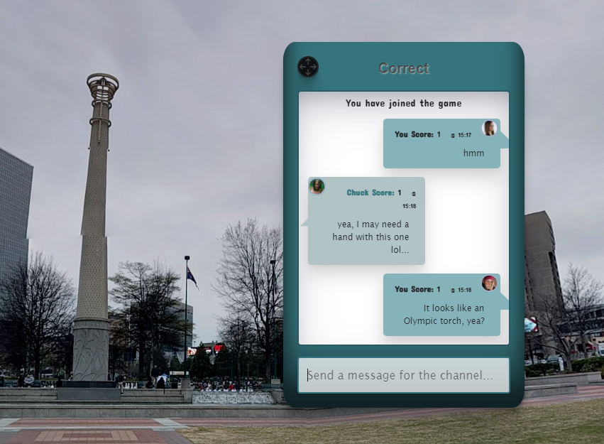
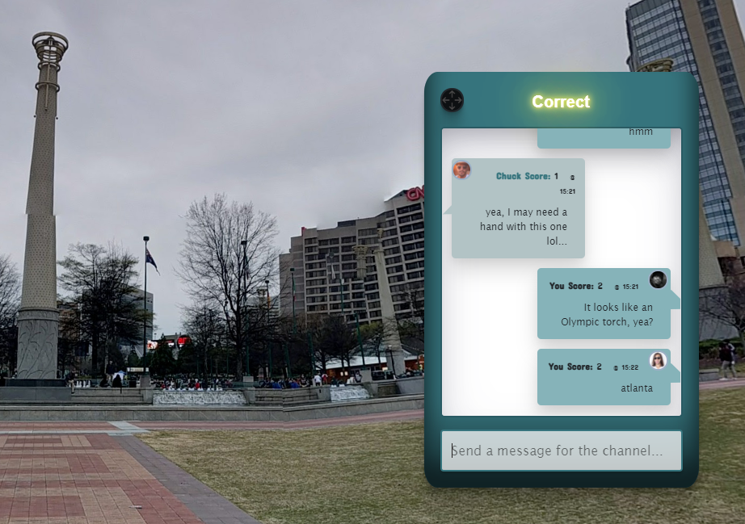
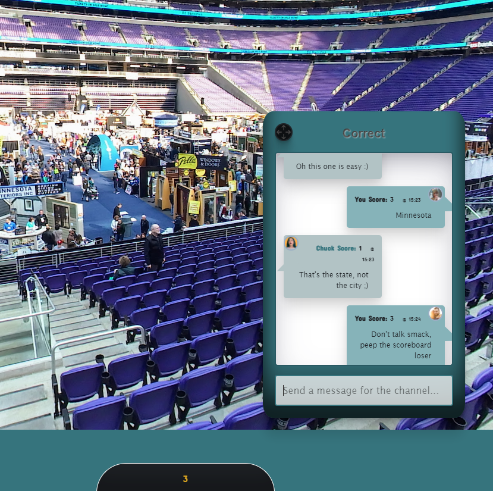

# Map Marauders
 

### Anthony Planisek

### Luke Spang

### Thomas Maxey

### Emmett Rushin

### Burke Beatty

### Kenneth Ferguson 
 

## Live Application
https://map-marauders.herokuapp.com/
 

    
## Description

This game application is a spin on the popular Geo Guessing game platform. Like many other Geo Guessing games, we us the google maps api to drop you into an interactive panoramic view of a random United States city. What makes us unique is that our game can be played simultaneously with your friends. Using the socket.io chat feature you can see what others players are guessing as well as everyone's point totals. You can also reach out to other players for help during the game if you get stumped. 

 

## License

This project/application is covered under the MIT license.

 

## Table of Contents

* [Install](#Install)
* [Usage](#Usage)
* [Features](#Features)
* [Contribute](#Contribute)
* [Questions](#Questions)

 
    

## Install

- Clone the GitHub repository
- Update the heroku route (if being run on local host)
- Add `.env` file with jawsDB info
- npm i dependencies (if being run on local host)

 

## Usage

This application is for fun. Enjoy it with your friends, family, or even by yourself. Our application has multiple unique pages and features. 
 

## Home Screen
The home screen has a transitional background with a nav bar featuring login, logout, and register buttons. All are dependent on the status of the user at that time. We also have the game modes featured in the middle of the screen. At this time we only have United States Cities, but we an easily expand to new modes soon. The search bar will also be implemented in the future to find friends. 
 

 

## Account Creation
 
The registration/account creation screen allows new users to create accounts in order to play the games. This allows them to currently keep track of high score and log into chat. In the future we want to incorporate a custom avatar/image for users to use for their account. 
 

 

## Account Management
 
The account management page allows users to reset passwords in the database as well as in the future, hopefully allow them to update the avatar that is displayed in game!
 

 

## Game Page
 
The game page has a lot of fun stuff. The we have our standard nav bar, as well as a score tracker in the footer. The main even is interactive google maps panoramic view overlayed with a socket.io chat. The stylized chat box allows you to interact with other uses as well as notifies you when your answer is correct. The page also refreshes after a correct answer to move onto the next round!
 

 

## Features
 
Some special features included in our game include the live chat, score tracking, user name, time the message was sent, and a spot for a unique avatar(meant for future development). When a message is sent the users profile name, current time, message itself, and avatar(custom in the future) will be displayed in the chat box. When a correct answer is submitted the correct message will illuminate and the game will reload for a new round. By reloading, the users score will update and a new location will be presented! The users score is saved in a database for current score updates, as well as player to player comparison in future updates!
 

 

 

## Contribute

Feel free to reach about ways that you can contribute to this game code, or extra features you would like to see added in the future. 

 

## Questions

If there are any questions regarding the repo, or any technical issues, please feel free to contact us at: map.maraudersunc@gmail.com 
